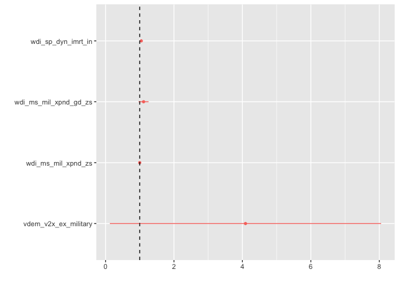
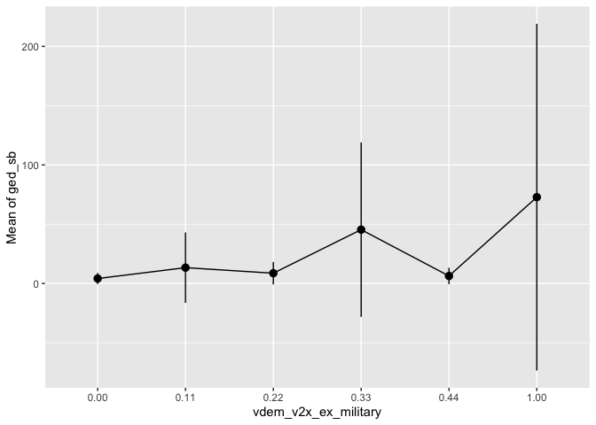
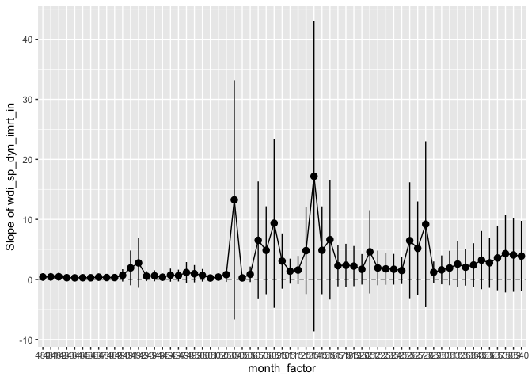
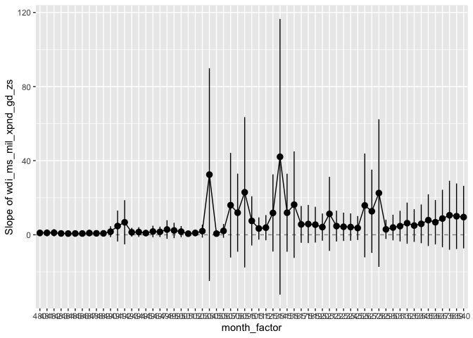
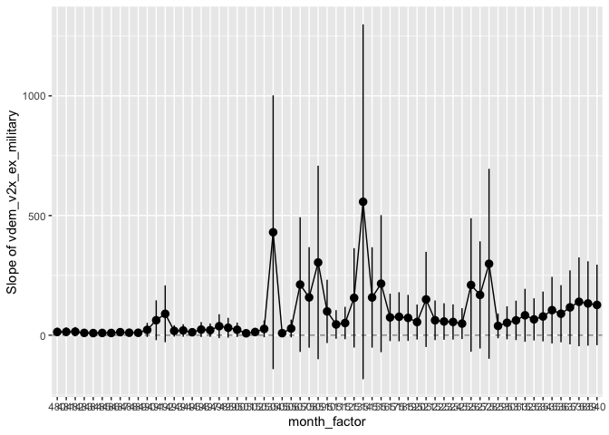

FAST Models for ‘cm’
================
Patrick T. Brandt

August 06, 2025

- [Model Options and Choices](#model-options-and-choices)
- [Initial Model Selection from Training and Validation
  Splits](#initial-model-selection-from-training-and-validation-splits)
- [Final FAST Model Using Test
  Split](#final-fast-model-using-test-split)
- [Selected model: Negative Binomial GLMM with
  covariates](#selected-model-negative-binomial-glmm-with-covariates)
- [Predictions](#predictions)
- [Forecast Summaries](#forecast-summaries)
- [Generate the cumulative forecast count
  distributions](#generate-the-cumulative-forecast-count-distributions)
- [Write out some results](#write-out-some-results)
- [Characterization of cumulative
  forecasts](#characterization-of-cumulative-forecasts)
- [Appendix](#appendix)
- [References](#references)

## Model Options and Choices

For the FAST analysis of the `cm` version of the VIEWS data, one faces a
series of choices in constructing a forecast model. These are summarized
by the following:

1.  *Units*: Are the data units of analysis (forecast units) countries,
    grid cells or over months or quarters? In this case the choice is
    country-months, denoted `cm` units.
2.  *Models*: There are a wide variety to consider here and they vary
    according to broad parameters set out prior. These include choices
    of
    1.  *Functional form*: Does one using fixed effects, mixed marginal
        effect, or something else?
    2.  *Distribution of the data*: do we assume a (marginal) Poisson,
        negative binomial, Tweedie, or some zero-inflated likelihood
        form?
3.  *Information Sets*:
    1.  *Covariates*: This is mainly a choice over the covariates of
        interest to the sponsor:

    - Climate
    - Food security
    - Demographics

    2.  *Other conditioning variables or units*: Do only nearest
        neighbors in spadfe and time matter or should all global data be
        leveraged (recall we have the `cm` data for the globe, but are
        scored on data for Africa and the Middle East). Here this will
        be either `Globe` or `Africa+ME`.
4.  *Scoring*: what criteria do we use to rank or evaluuate winners and
    losers? Options include root mean squared error (RMSE), bias,
    dispersion, continuous (discrete) rank probability scores (CRPS),
    etc.  
5.  *Forecast horizons* How many periods forward are needed in the
    forecasts? This is defined by the sponsor in months 3, 6, and 12.

## Initial Model Selection from Training and Validation Splits

A prior set of model selection rounds were conducted. These build on the
datasets and setup described
[here](https://github.com/PTB-OEDA/VIEWS-Startup) from May 2025.

Based on these data for the `cm` VIEWS dataset a series of models were
fit to constrain and select from the larger set of options above. *For a
RMSE criteria* using data from 2010:1–2022:6 and a validation comparison
sample of data from 2022:10-2023:9 the top models are in the following
table:

| Model                   | Information Set |     RMSE |   CRPS | Brier (\>25) |
|:------------------------|:----------------|---------:|-------:|-------------:|
| Neg Binom GLMM + COVAR  | Africa+ME       | 19537955 | 192.79 |        0.064 |
| Neg Binom GLMM          | Globe           | 19538070 | 194.05 |        0.069 |
| Neg Binom GLMM          | Africa+ME       | 19538482 | 194.56 |        0.069 |
| Tweedie GLMM            | Globe           | 19540700 | 194.31 |        0.066 |
| Tweedie GLMM + COVAR    | Africa+ME       | 19540995 | 192.45 |        0.058 |
| Tweedie GLMM            | Africa+ME       | 19542195 | 194.64 |        0.061 |
| Poisson GLMM            | Globe           | 19544318 | 197.49 |        0.090 |
| Poisson GLMM + COVAR    | Africa+ME       | 19546057 | 197.11 |        0.103 |
| Poisson GLMM            | Africa+ME       | 19546568 | 198.41 |        0.108 |
| ZIP+FE                  | Africa+ME       | 19558650 | 279.40 |        0.845 |
| Poisson+FE              | Africa+ME       | 19560708 | 280.66 |        0.845 |
| ZIP+FE                  | Globe           | 19567670 | 254.33 |        0.823 |
| ZINB+FE                 | Globe           | 19567707 | 202.01 |        0.135 |
| Poisson+FE              | Globe           | 19567839 | 254.33 |        0.823 |
| Neg Bin+FE              | Africa+ME       | 19571068 | 263.17 |        0.788 |
| Tweedie+FE              | Africa+ME       | 19575630 | 297.61 |        0.803 |
| ZINB+FE                 | Africa+ME       | 19575884 | 204.90 |        0.134 |
| exactly_zero            | Africa+ME       | 19576285 | 202.35 |        0.155 |
| last_historical         | Africa+ME       | 19577040 | 214.20 |        0.303 |
| Tweedie+FE              | Globe           | 19586937 | 275.34 |        0.671 |
| Neg Bin+FE              | Globe           | 19593893 | 279.72 |        0.609 |
| ZIP+LAGS+COVAR          | Africa+ME       | 19774339 | 289.54 |        0.339 |
| conflictology_country12 | Africa+ME       | 21027264 | 380.43 |        0.297 |
| Poisson+LAGS+COVAR      | Africa+ME       | 23066160 | 399.25 |        0.627 |
| ZIP+LAGS                | Africa+ME       | 33776972 | 518.63 |        0.231 |

Top 25 Models from Training and Validation (sorted by RMSE)

From the prior model searching documented in the scripts in the
Appendix, *the chosen models on the RMSE and CRPS criteria are those
with negative binomial or Tweedie distribution likelihoods and the
inclusion of the specified predictor covariates* (consistent with Hegre
et al. (2025) and Brandt (2023)). Note that these results also are
better than the VIEWS baseline models of `exactly_zero`,
`last_historical` and `conflictology_country12` (for details see Hegre
et al. (2025)).

Several conclusions come from these results over the model, covariates,
information set, and other choices:

- *Tweedie or Negative binomial models makes the most sense.* Zero
  inflation models are genreally not as performative in a RMSE, CRPS, or
  Brier score comparison.
- *General linear mixed model (GLMM) of unit effects are preferred over
  fixed effects.* All of the GLMM model rank above the fixed effects
  (`FE`) models.
- *Information set choice favors using the data only from `Africa+ME` in
  most cases.* There are a few exceptions to this that interact with the
  model and the covariates, but there is enough of a pattern to lean in
  this direction.

## Final FAST Model Using Test Split

For the final selection of forecast models the evaluation is done over a
training set of data from 2010:1–2023:6, evaluated over a testing data
from 2023:10–2024:9. (Here we have separated out the `COVAR` portion of
the earlier presentation into a separate column factor across the
proposed specifications)

| Model | Information Set | Covariates | RMSE | CRPS | Brier (\>25) |
|:---|:---|:---|---:|---:|---:|
| Neg Binom GLMM | Africa+ME | No | 252704.4 | 64.21 | 0.085 |
| Neg Binom GLMM | Africa+ME | Yes | 252849.4 | 64.24 | 0.076 |
| Neg Binom GLMM | Globe | No | 253000.7 | 63.90 | 0.078 |
| Tweedie GLMM | Africa+ME | No | 253046.3 | 64.86 | 0.096 |
| Neg Binom GLMM | Globe | Yes | 253234.2 | 63.93 | 0.071 |
| Tweedie GLMM | Africa+ME | Yes | 253289.4 | 64.95 | 0.087 |
| Tweedie GLMM | Globe | No | 253307.0 | 64.95 | 0.094 |
| Tweedie GLMM | Globe | Yes | 253617.8 | 65.05 | 0.085 |
| Poisson GLMM | Globe | No | 254495.9 | 68.24 | 0.118 |
| Poisson GLMM | Globe | Yes | 254515.1 | 68.10 | 0.110 |
| Poisson GLMM | Africa+ME | Yes | 254946.6 | 68.79 | 0.122 |
| Poisson GLMM | Africa+ME | No | 254995.9 | 69.07 | 0.129 |
| exactly_zero | Africa+ME | No | 258082.0 | 74.95 | 0.195 |
| exactly_zero | Globe | No | 258082.0 | 74.95 | 0.195 |
| last_historical | Africa+ME | No | 264660.7 | 95.09 | 0.259 |
| last_historical | Globe | No | 330219.2 | 99.83 | 0.238 |
| conflictology_country12 | Globe | No | 1764605.1 | 204.08 | 0.244 |
| conflictology_country12 | Africa+ME | No | 2992357.2 | 289.59 | 0.274 |

Models from Final Test (sorted by RMSE)

Based on each of the follow criteria, the best models over the full test
sample are

- *RMSE*: Negative Binomial GLMM fit to the Africa+ME data *without*
  covariates.
- *CRPS*: Negative Binomial GLMM fit to the Globe data *without*
  covariates.
- *Brier*: Negative Binomial GLMM fit to the Globe data *with*
  covariates.

## Selected model: Negative Binomial GLMM with covariates

This shows the code and estimation of the final model, based on the
[initial data setup documented
here](https://github.com/PTB-OEDA/VIEWS-Startup/blob/main/Brandt-VIEWS2-Demo.md#reading-in-data)
and then processed with `setup.R`

``` r
rm(list=ls())
load("cm_subsets.RData")

# Only keeps the global dataset
rm(list = setdiff(ls(), "globe"))
   
# Fit the model as in all the earlier setup code and comparisons.
# Here we just fit the final model selected in the prior section
library(glmmTMB)

# From the formulas.R script...
frm.glmm <- as.formula("ged_sb ~ ar1(month_factor + 0|country_id) + 
                        wdi_sp_dyn_imrt_in + 
                        wdi_ms_mil_xpnd_gd_zs +
                        wdi_ms_mil_xpnd_zs +
                        vdem_v2x_ex_military")

FAST.cm <- glmmTMB(frm.glmm,
                   family = nbinom1(),
                   data=globe)
```

### Characterization of Selected Model

Below is a regression table for the fixed effects covariates. These are
presented as odds ratios for the covariates in the model.

               ─────────────────────────────────────────────────
                                                NBGLMM          
                                       ─────────────────────────
                 (Intercept)                         0.000 ***  
                                                    (0.000)     
                 wdi_sp_dyn_imrt_in                  1.044 **   
                                                    (0.017)     
                 wdi_ms_mil_xpnd_gd_zs               1.112      
                                                    (0.075)     
                 wdi_ms_mil_xpnd_zs                  0.999      
                                                    (0.013)     
                 vdem_v2x_ex_military                4.090 **   
                                                    (2.022)     
               ─────────────────────────────────────────────────
                 *** p < 0.001; ** p < 0.01; * p < 0.05.        

Column names: names, NBGLMM

### Covariate effects for the selected model

Same as above, just graphical for the odds ratios:

    ## 
    ## Attaching package: 'ggplot2'

    ## The following object is masked from 'package:huxtable':
    ## 
    ##     theme_grey

<div class="figure" style="text-align: center">


<p class="caption">

Odds ratios for selected covariates in the NBGLMM.
</p>

</div>

### Average marginal predictions for explanations

This is overly explicit (since there are only 4 fixed effect variables
across all the units). (If more covaraites are added, this should be
done with vectorization or functions rather than for each variable.).
Note these these are conservative effects since the estimates are the
conditional predictions (given the mixed effects for the time-units).
For details see
[here](https://easystats.github.io/modelbased/articles/mixed_models.html#generalized-linear-mixed-models)

``` r
library(modelbased, quietly = TRUE, warn.conflicts = FALSE)
imrt_in_effect <- estimate_means(FAST.cm, "wdi_sp_dyn_imrt_in", 
                                 estimate = "average")
mil_xpnd_gd_zs_effect <- estimate_means(FAST.cm, "wdi_ms_mil_xpnd_gd_zs", 
                                        estimate = "average")
mil_xpnd_zs_effect <- estimate_means(FAST.cm, "wdi_ms_mil_xpnd_zs", 
                                     estimate = "average")
vdem_milex_effect <- estimate_means(FAST.cm, "vdem_v2x_ex_military", 
                                    estimate = "average")

par(mfrow=c(1,2))
plot(imrt_in_effect)
#plot(mil_xpnd_gd_zs_effect)
#plot(mil_xpnd_zs_effect)
plot(vdem_milex_effect)
```

<figure>

<figcaption aria-hidden="true">Average marginal effects for
NBGLMM</figcaption>
</figure>

### Average conditional predictions for explanations over time

Same as above, but with accounting for the random effects – smaller
effects and possibly messier to interpret, but more realistic of the
decision-maker’s problem.

``` r
plot(estimate_slopes(FAST.cm, 
                     trend = "wdi_sp_dyn_imrt_in",
                     by = "month_factor = seq(480, 540)", 
                     predict = "conditional"), 
     main = "Infant Mortaility effects over time")
```

<!-- -->

``` r
plot(estimate_slopes(FAST.cm, 
                     trend = "wdi_ms_mil_xpnd_gd_zs",
                     by = "month_factor = seq(480, 540)", 
                     predict = "conditional"), 
     main = "mil_xpnd_gd_zs effects over time")
```

<!-- -->

``` r
plot(estimate_slopes(FAST.cm, 
                     trend = "vdem_v2x_ex_military", 
                     by = "month_factor = seq(480, 540)", 
                     predict = "conditional"), 
     main = "VDEM Mil. Exp. effects over time")
```

<!-- -->

## Predictions

``` r
# Loads a function for predictions from GLMMs
source("predictglmm.R")

ds <- FAST.cm$frame

# Get last 12 months of data
#dim(ds[as.numeric(ds$month_factor)>(max(as.numeric(ds$month_factor))-12),])
xforcs <- ds[as.numeric(ds$month_factor)>(max(as.numeric(ds$month_factor))-12),]

# Set the month_factor variable and then the covariates by country to match
# the grouping in the GLMM

xnew <- aggregate(xforcs[,4:7], by=list(xforcs$country_id), mean)
names(xnew)[1] <- "country_id"

# Make new country-month ids
idxs <- expand.grid(xnew$country_id, 550:561)
colnames(idxs) <- c("country_id", "month_id")

xout <- merge(idxs, xnew, by="country_id")
xout$month_factor <- as.factor(xout$month_id)
xout$ged_sb <- NA


# Generate the predictions with function loaded earlier
set.seed(324)
forcs <- predictglmm(FAST.cm, newdata = xout, N=1000)
```

## Forecast Summaries

This shows how to generate and label the forecast summaries from the
forecast sample (`N=1000`).

``` r
# Get country labels for any formatting below -- use latest
countrylabels <- globe[globe$month_id==max(globe$month_id),
                       c("country_id", "name", "isoname",
                         "isoab", "isonum", "gwcode")]

# Mean forecast for each country-month
mean.forcs <- forcs %>% group_by(country_id, month_id) %>% 
  summarise(total = mean(predicted))

# Add labels to mean forecasts
mean.forcs <- merge(mean.forcs, countrylabels[,c(1,2,4)],
                    by="country_id")
names(mean.forcs)[3] <- "predicted"

# Add dates to mean forecasts
forc.idx <- data.frame(month_id = 550:561, 
                       dates=seq(as.Date("2025-10-01"),
                                 by="month", length=12))

# Merge so things have correct labels
mean.forcs <- merge(mean.forcs, forc.idx, by="month_id")

# Generate cumulative mean forecasts for each country 
# over the 12 months of performance.
#
# Remember this work since the mean of the sum is the sum
# of the means

cum.mean.forcs <-  mean.forcs %>% group_by(country_id) %>% 
  mutate(cumulative_predicted = cumsum(predicted)) %>%
  arrange(country_id, month_id)
```

## Generate the cumulative forecast count distributions

This is a bit trickier than the totaling of the cumulative means. The
target prediction here is whether of not there are more than 25 deaths
(so predicting when a cumulant of `ged_sb` \> 25) in a target period.

There is a “right” and a “wrong” way to do this computation and it
matters since the probability of the cumulative event is not the
cumulative of the probability of the event. So one needs to take some
care in this computation when considering it in a model and for a sample
of forecasts. (It is a classic case of wanting an expectation of a
relevant function not a function of the expectation.)

``` r
tmp <- forcs %>% group_by(country_id, month_id, sample_id) %>% summarise(cp = cumsum(predicted)>25) 

pover25 <- tmp %>% group_by(country_id, month_id) %>%
  summarise(mean(cp))

pover25 <- merge(pover25, countrylabels[,c(1,2,4)],
                 by="country_id")
pover25 <- merge(pover25, forc.idx, by="month_id")
names(pover25)[3] <- "Pr(Cum>25)"
rm(tmp)
```

## Write out some results

``` r
# Merge the mean, cumulative mean, and Pr(Cumulative>25)
out <- merge(as.data.frame(cum.mean.forcs),
             pover25[,1:3], by = c("country_id", "month_id"))

# Write the summary results out into a spreadsheet
library(writexl)
write_xlsx(x = list("Forecasts" = out),
           path = "FAST-cm-Forecasts.xlsx")

# Save the forecast sample
save(forcs, file = "ForecastSample.RData")
```

## Characterization of cumulative forecasts

Where are the highest cumulative forecasts in month 3 (December 2025)?

| month_id | country_id | predicted | name | isoab | dates | cumulative_predicted |
|---:|---:|---:|:---|:---|:---|---:|
| 552 | 60 | 23.976 | Iraq | IRQ | 2025-12-01 | 76.288 |
| 552 | 28 | 27.046 | Colombia | COL | 2025-12-01 | 86.761 |
| 552 | 223 | 31.381 | India | IND | 2025-12-01 | 99.274 |
| 552 | 50 | 42.118 | Mali | MLI | 2025-12-01 | 130.975 |
| 552 | 47 | 44.760 | Burkina Faso | BFA | 2025-12-01 | 139.144 |
| 552 | 167 | 50.134 | Congo, DRC | COD | 2025-12-01 | 156.375 |
| 552 | 133 | 51.644 | Afghanistan | AFG | 2025-12-01 | 162.024 |
| 552 | 124 | 55.306 | Yemen | YEM | 2025-12-01 | 177.412 |
| 552 | 57 | 97.453 | Ethiopia | ETH | 2025-12-01 | 311.661 |
| 552 | 94 | 108.962 | Lebanon | LBN | 2025-12-01 | 346.904 |
| 552 | 79 | 113.313 | Nigeria | NGA | 2025-12-01 | 355.057 |
| 552 | 120 | 124.280 | Somalia | SOM | 2025-12-01 | 394.969 |
| 552 | 149 | 135.042 | Myanmar | MMR | 2025-12-01 | 433.907 |
| 552 | 78 | 140.505 | Niger | NER | 2025-12-01 | 442.857 |
| 552 | 136 | 201.261 | Pakistan | PAK | 2025-12-01 | 649.905 |
| 552 | 220 | 404.222 | Syria | SYR | 2025-12-01 | 1310.042 |
| 552 | 245 | 419.866 | Sudan | SDN | 2025-12-01 | 1346.092 |
| 552 | 65 | 1134.935 | Russia | RUS | 2025-12-01 | 3645.834 |
| 552 | 218 | 1430.816 | Israel | ISR | 2025-12-01 | 4621.767 |
| 552 | 117 | 4221.503 | Ukraine | UKR | 2025-12-01 | 13989.559 |

Highest predicted forecasts, December 2025

Where are the highest cumulative forecasts in month 6 (March 2026)?

| month_id | country_id | predicted | name | isoab | dates | cumulative_predicted |
|---:|---:|---:|:---|:---|:---|---:|
| 555 | 60 | 20.855 | Iraq | IRQ | 2026-03-01 | 141.876 |
| 555 | 28 | 22.990 | Colombia | COL | 2026-03-01 | 159.972 |
| 555 | 223 | 26.421 | India | IND | 2026-03-01 | 183.883 |
| 555 | 50 | 36.796 | Mali | MLI | 2026-03-01 | 246.151 |
| 555 | 47 | 38.910 | Burkina Faso | BFA | 2026-03-01 | 261.926 |
| 555 | 167 | 41.619 | Congo, DRC | COD | 2026-03-01 | 290.458 |
| 555 | 133 | 43.822 | Afghanistan | AFG | 2026-03-01 | 299.896 |
| 555 | 124 | 47.978 | Yemen | YEM | 2026-03-01 | 330.458 |
| 555 | 57 | 82.864 | Ethiopia | ETH | 2026-03-01 | 573.976 |
| 555 | 94 | 88.274 | Lebanon | LBN | 2026-03-01 | 629.624 |
| 555 | 79 | 95.708 | Nigeria | NGA | 2026-03-01 | 657.576 |
| 555 | 120 | 106.397 | Somalia | SOM | 2026-03-01 | 731.356 |
| 555 | 149 | 114.197 | Myanmar | MMR | 2026-03-01 | 799.304 |
| 555 | 78 | 121.191 | Niger | NER | 2026-03-01 | 824.930 |
| 555 | 136 | 172.344 | Pakistan | PAK | 2026-03-01 | 1200.532 |
| 555 | 220 | 325.003 | Syria | SYR | 2026-03-01 | 2361.893 |
| 555 | 245 | 347.300 | Sudan | SDN | 2026-03-01 | 2465.633 |
| 555 | 65 | 886.321 | Russia | RUS | 2026-03-01 | 6543.786 |
| 555 | 218 | 1110.128 | Israel | ISR | 2026-03-01 | 8252.646 |
| 555 | 117 | 3270.033 | Ukraine | UKR | 2026-03-01 | 24787.770 |

Highest predicted forecasts, March 2026

Where are the highest cumulative forecasts in month 12 (September 2026)?

| month_id | country_id | predicted | name | isoab | dates | cumulative_predicted |
|---:|---:|---:|:---|:---|:---|---:|
| 561 | 60 | 14.498 | Iraq | IRQ | 2026-09-01 | 242.840 |
| 561 | 28 | 16.024 | Colombia | COL | 2026-09-01 | 272.278 |
| 561 | 223 | 19.325 | India | IND | 2026-09-01 | 315.778 |
| 561 | 50 | 28.113 | Mali | MLI | 2026-09-01 | 435.411 |
| 561 | 47 | 29.835 | Burkina Faso | BFA | 2026-09-01 | 460.277 |
| 561 | 167 | 31.664 | Congo, DRC | COD | 2026-09-01 | 506.547 |
| 561 | 133 | 32.250 | Afghanistan | AFG | 2026-09-01 | 518.771 |
| 561 | 124 | 35.119 | Yemen | YEM | 2026-09-01 | 571.852 |
| 561 | 57 | 57.613 | Ethiopia | ETH | 2026-09-01 | 974.440 |
| 561 | 94 | 59.697 | Lebanon | LBN | 2026-09-01 | 1054.750 |
| 561 | 79 | 69.790 | Nigeria | NGA | 2026-09-01 | 1133.800 |
| 561 | 120 | 77.027 | Somalia | SOM | 2026-09-01 | 1262.953 |
| 561 | 149 | 80.004 | Myanmar | MMR | 2026-09-01 | 1359.696 |
| 561 | 78 | 90.383 | Niger | NER | 2026-09-01 | 1435.959 |
| 561 | 136 | 123.335 | Pakistan | PAK | 2026-09-01 | 2060.828 |
| 561 | 220 | 217.047 | Syria | SYR | 2026-09-01 | 3922.442 |
| 561 | 245 | 241.879 | Sudan | SDN | 2026-09-01 | 4159.521 |
| 561 | 65 | 557.141 | Russia | RUS | 2026-09-01 | 10670.510 |
| 561 | 218 | 705.735 | Israel | ISR | 2026-09-01 | 13398.871 |
| 561 | 117 | 2006.682 | Ukraine | UKR | 2026-09-01 | 39761.365 |

Highest predicted forecasts, September 2026

## Appendix

The initial model runs to do preliminary model selection and
specification searches are all run via a set of batch scripts included
with this repo. These are run in the following sequence via the
`batch.sh` bash shell script to invoke `R` and the code files
designated.

``` default
#! bash

# Training models
R CMD BATCH setup.R
R CMD BATCH modelselect.R &
R CMD BATCH modelselect-globe.R

# Validation models
R CMD BATCH modelselect-valid.R &
R CMD BATCH modelselect-globe-valid.R

R CMD BATCH modelselect-glmm-covar.R

# Scoring across the sets
R CMD BATCH scoring-cm.R
R CMD BATCH scoring-cm-valid.R
```

## References

<div id="refs" class="references csl-bib-body hanging-indent"
entry-spacing="0">

<div id="ref-brandt23:_views" class="csl-entry">

Brandt, Patrick T. 2023. “VIEWS 2.0 Bayesian Density Forecasts
Replication Code: Setup and Estimation.”
<https://github.com/PTB-OEDA/VIEWS2-DensityForecasts>.

</div>

<div id="ref-Hegreetal2025" class="csl-entry">

Hegre, Håvard, Paola Vesco, Michael Colaresi, Jonas Vestby, Alexa
Timlick, Noorain Syed Kazmi, Angelica Lindqvist-McGowan, et al. 2025.
“The 2023/24 VIEWS Prediction Challenge: Predicting the Number of
Fatalities in Armed Conflict, with Uncertainty.” *Journal of Peace
Research* 0 (0): 00223433241300862.
<https://doi.org/10.1177/00223433241300862>.

</div>

</div>
